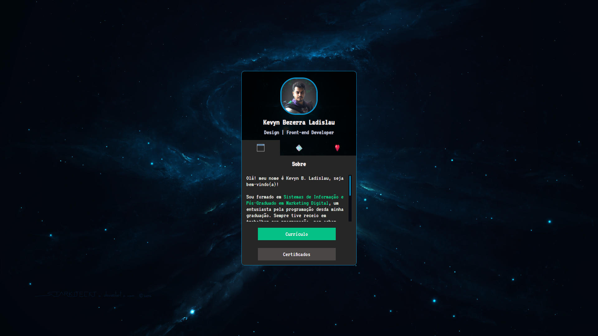

<h1 align="center">.:| Projeto Cartão de Visitas |:.</h1>

<h2 align="center">📖Descrição</h2>

Um projeto de um cartão de visitas digital que redireciona para meu curriculo, certificações, principais projetos que já desenvolvi e minhas redes sociais, também baseado em um projeto do Dev em Dobro, 100% responsivo.

<h2 align="center">🖥Preview</h2>

</img>

#### Veja o projeto funcionando <a href="https://kevynfirst.github.io/cartao-de-visitas">aqui</a>. 👈

<h2 align="center">🛠 Tecnologias</h2>

- [HTML5](https://html.com/)
- [CSS3](https://developer.mozilla.org/pt-BR/docs/Web/CSS)
- [Javascript](https://www.javascript.com/)

## Obrigado por visitar meu projeto 😉
<i>Você pode conferir outros projetos que desenvolvi aqui no meu GitHub, ou entrar em contato comigo pelos demais links.</i>
 

 

  

  

